# CodeAlpha: Network Intrusion Detection & Prevention System (NIDS/IPS) 🛡️

## 📝 Project Overview
This project is part of the **CodeAlpha Cyber Security Internship**. It demonstrates a step-by-step implementation of a Network Intrusion Detection System (NIDS) using **Snort 3**, followed by the development of an automated Intrusion Prevention System (IPS) using a custom **Python script** and `iptables`.

## ⚙️ Step-by-Step Implementation & Demonstration

### Step 1: Environment Setup & Interface Identification
First, Snort was installed and the version was verified. Then, the network interfaces were checked to ensure Snort listens on the correct interface (`eth0`).

**Checking Snort Version:**
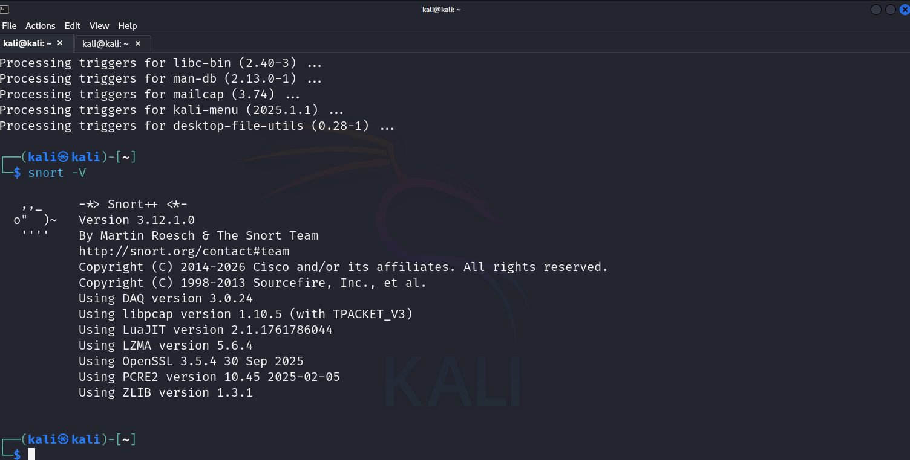

**Checking IP Address:**
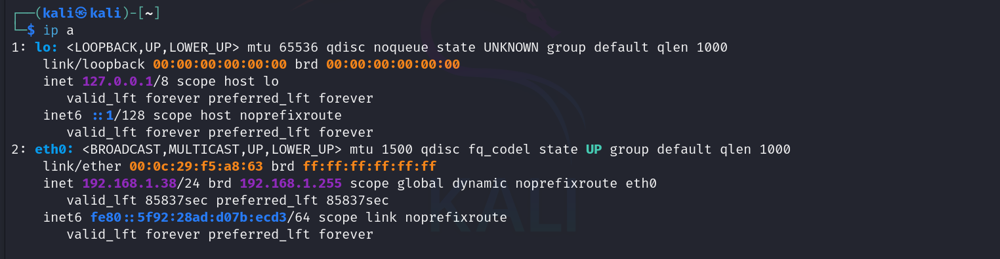

**Identifying Network Interface:**
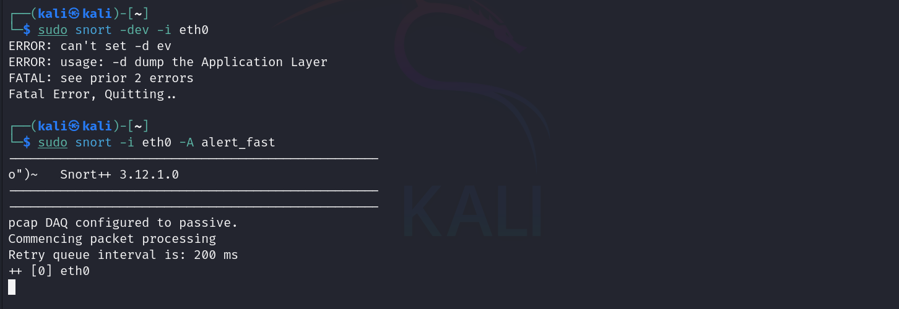

### Step 2: Rule Configuration
A custom rule was created in `local.rules` to detect ICMP (Ping) traffic, and the Snort configuration was validated.

**Custom Rule Configuration:**
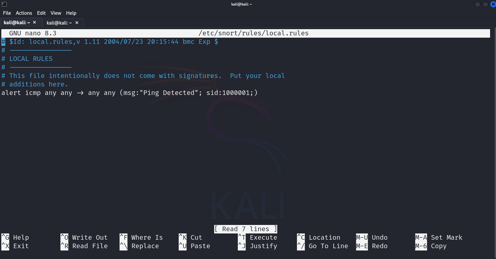

**Configuration Validation:**
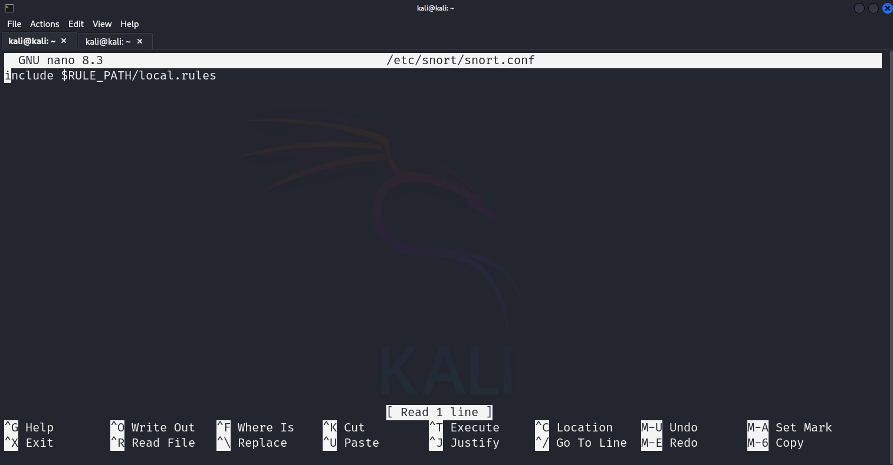

### Step 3: Initial Testing (Localhost)
To verify the NIDS is working, a test ping was initiated from the Kali machine. Snort successfully detected the traffic.

**Test Ping Executed:**
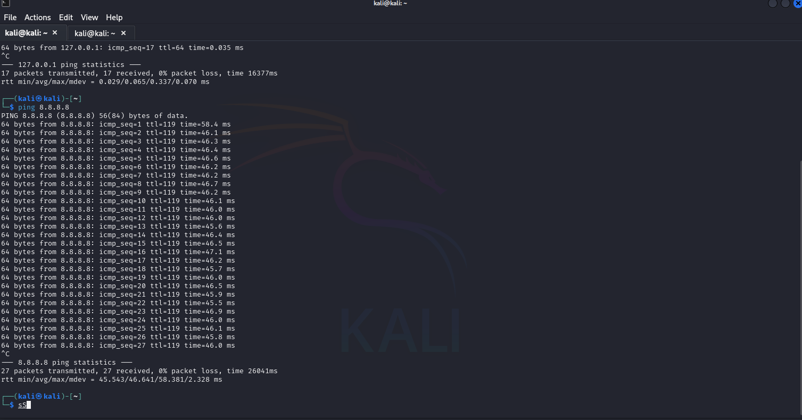

**Ping Successfully Detected by Snort:**
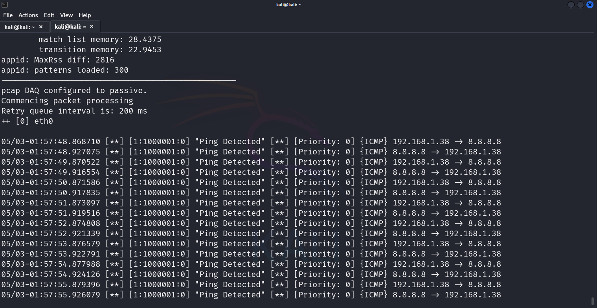

### Step 4: Automating the Response (IPS Script)
To upgrade the system from NIDS (Detection) to IPS (Prevention), a Python script was developed. Snort was configured to output alerts directly to a log file (`alert.txt`), which the script actively monitors.

**Python IPS Script Creation:**
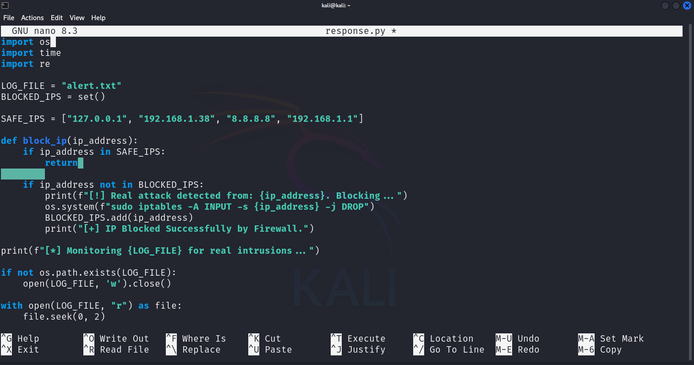
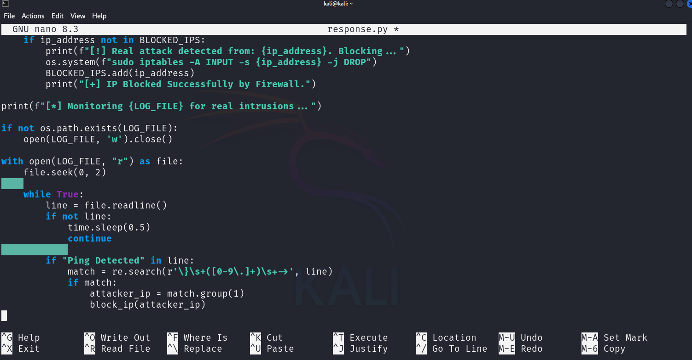

**Snort Logging Output:**
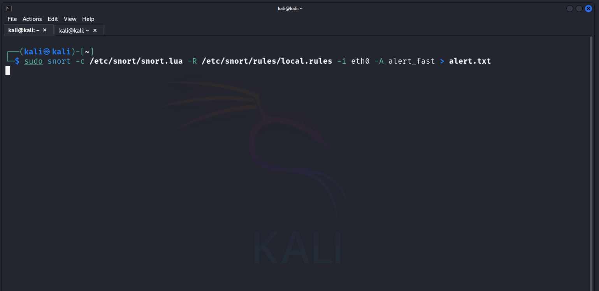

### Step 5: Live Attack Simulation (Windows XP)
The script was activated, and a live attack was simulated using a separate Windows XP machine to prove the concept in a realistic environment.

**Activating the IPS Script:**
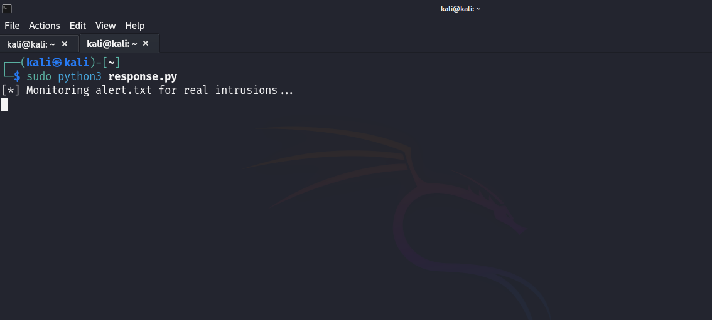

**Identifying Attacker's IP (Windows XP):**
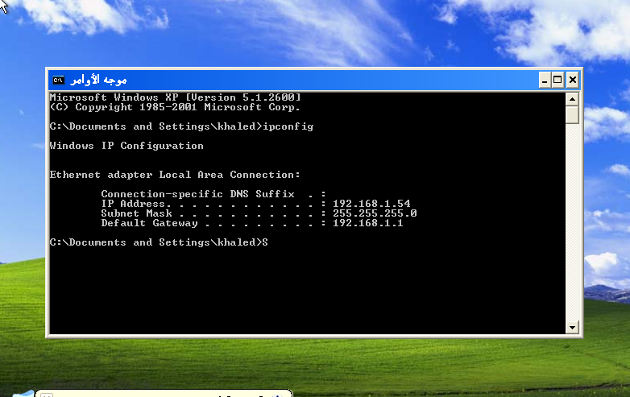

**Attacker Initiates Ping Sweep:**
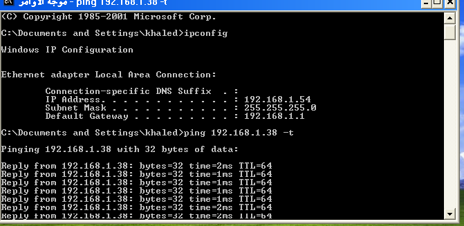

### Step 6: Detection, Blocking, and Neutralization
The system detected the incoming attack from the Windows XP machine. The Python script immediately parsed the log, identified the malicious IP, and dynamically blocked it via the firewall.

**Attack Detected:**
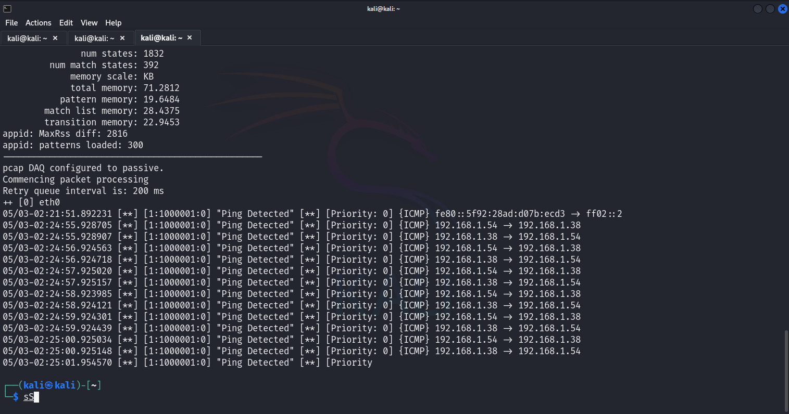

**IP Automatically Blocked by Script:**
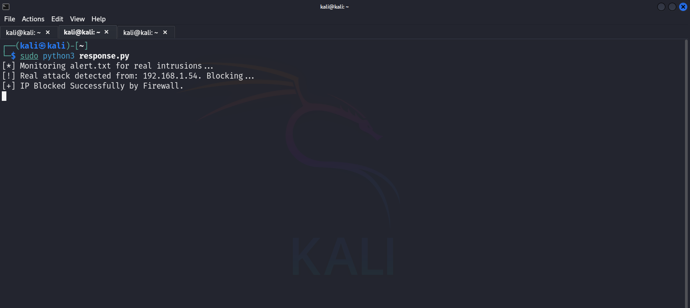

**Connection Dropped (Attack Neutralized):**
The attacker's terminal immediately shows a "Request timed out" message, confirming the packets are successfully dropped by the Linux firewall.
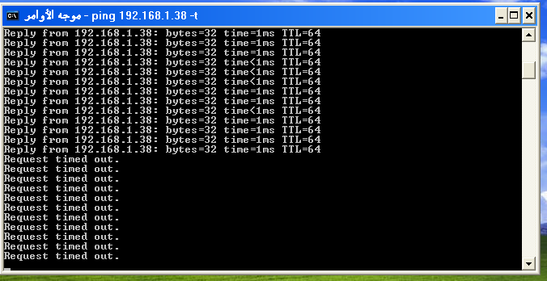

---

## 📂 Repository Contents
- `local.rules`: The custom rules configuration file for Snort.
- `response.py`: The Python script responsible for log parsing and automated IP blocking.
- `screenshots/`: Directory containing all execution and demonstration screenshots.

## 🛠️ Tools & Technologies Used
- Linux (Kali) & Windows XP
- Snort 3 (NIDS)
- Python 3 (Automation)
- iptables (Firewall)
