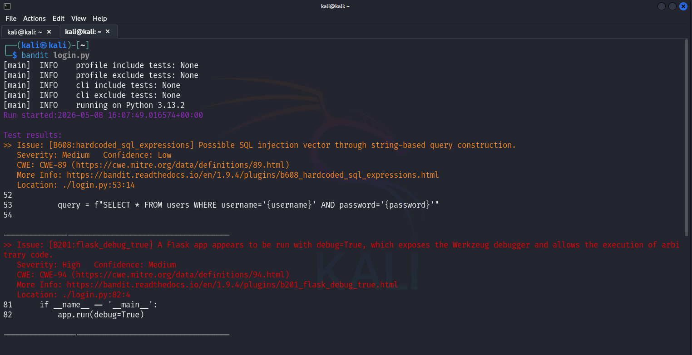
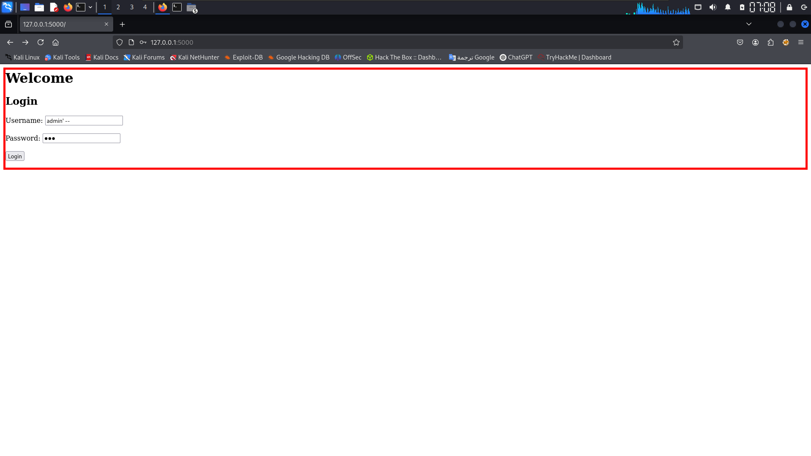
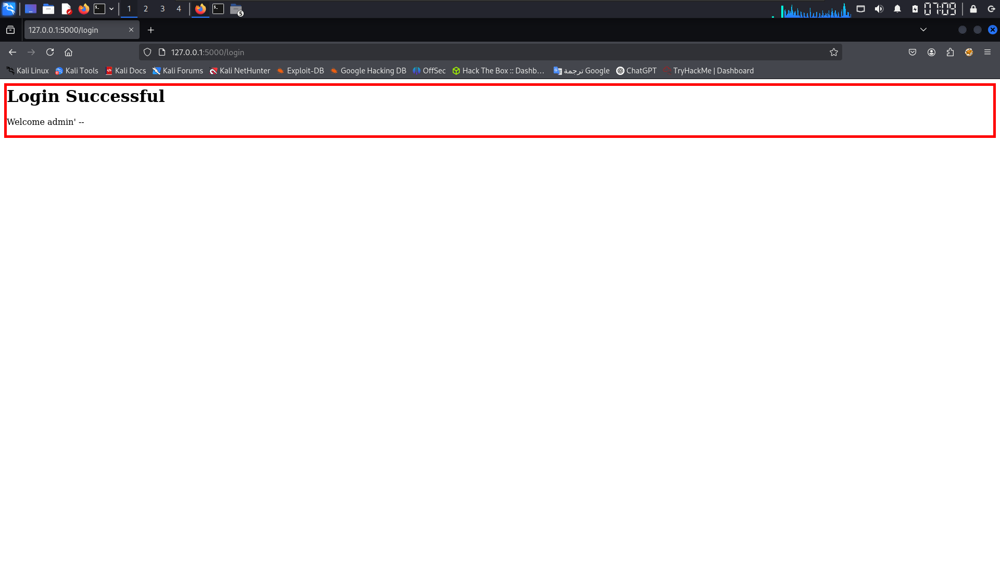
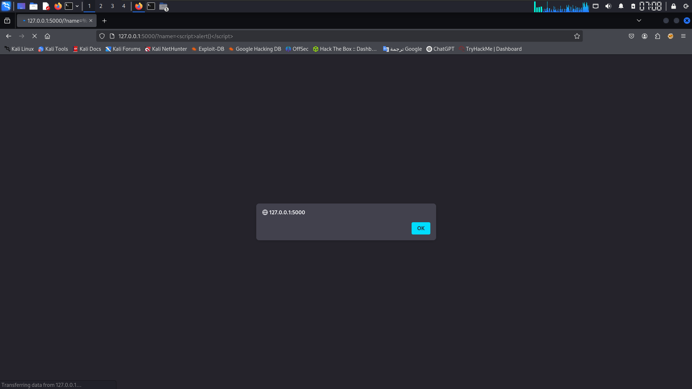
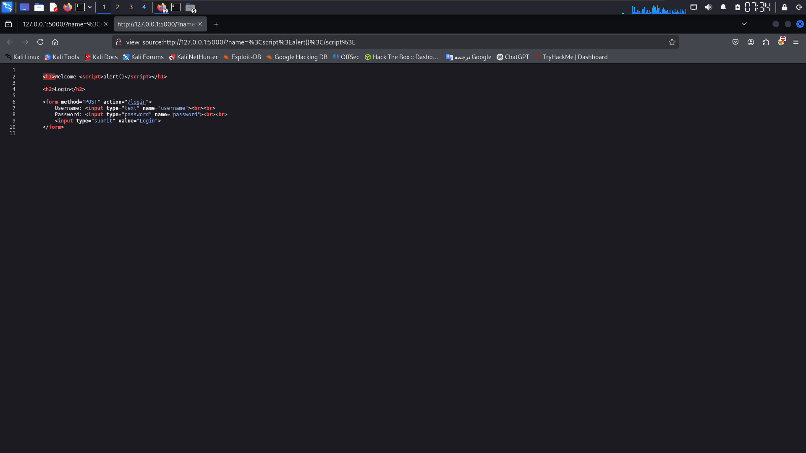
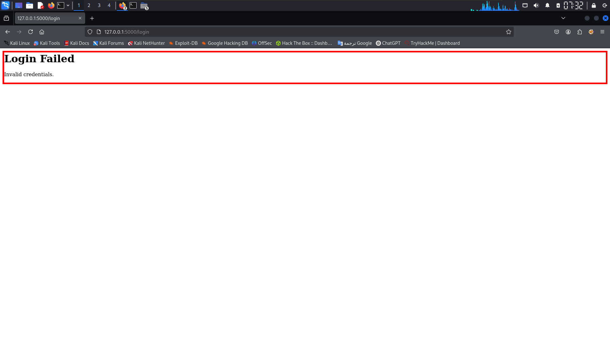
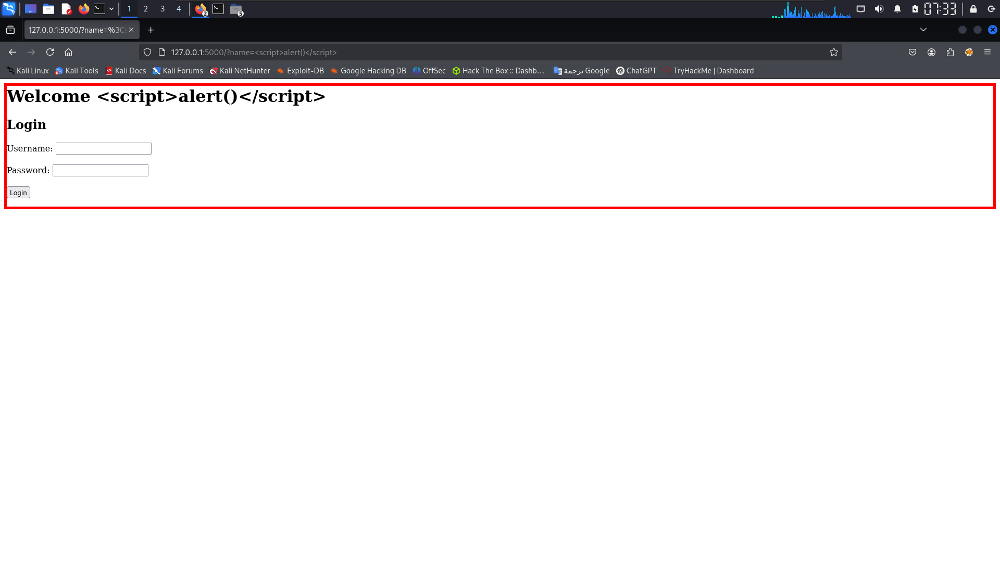
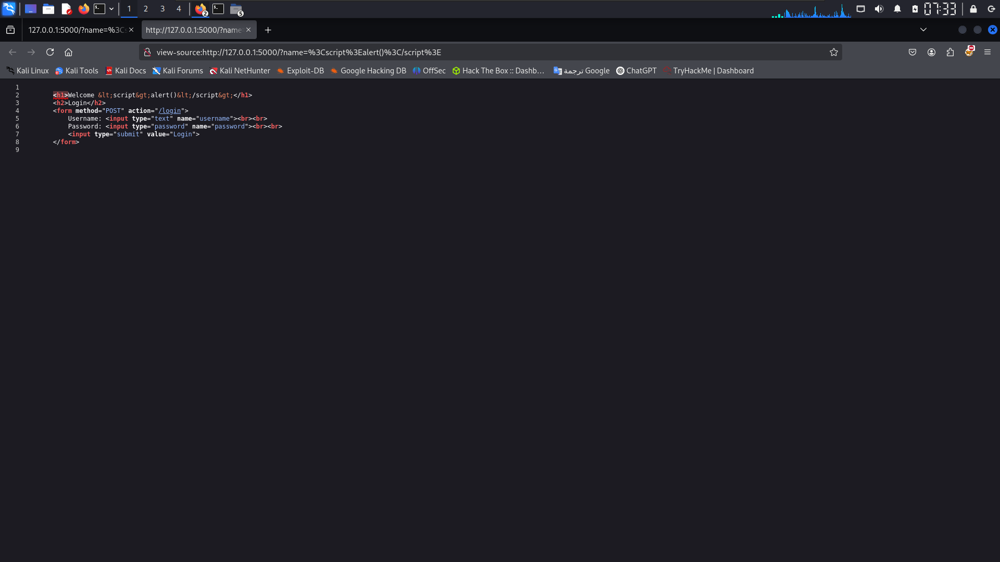
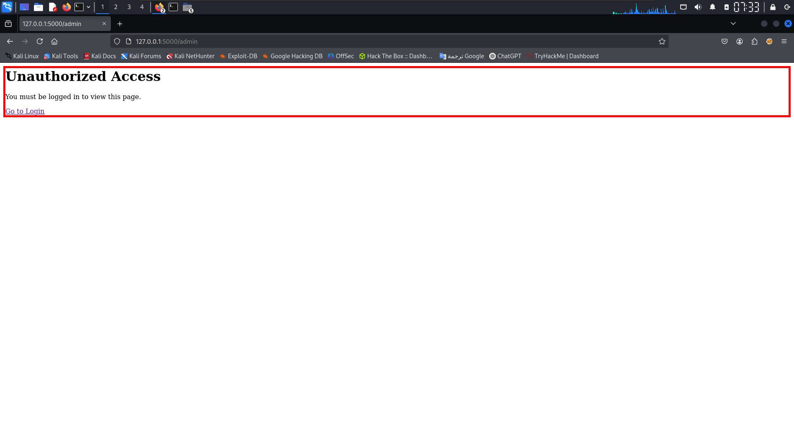

# CodeAlpha: Secure Coding Review & Remediation 🛡️

## 📝 Project Overview
In this task, I performed a **Secure Code Review** on a Python Flask application. The project involved identifying common web vulnerabilities through both automated tools and manual inspection, then refactoring the code to implement security best practices.

## 🤖 Step 1: Automated Analysis (SAST)
I used **Bandit**, a security linter for Python, to scan the vulnerable source code. It successfully identified the SQL Injection risk and Debug Mode.

**Bandit Scan Results:**

---

## 🔍 Step 2: Manual Review & Exploitation (Vulnerable Version)

### 1. SQL Injection (SQLi)
* **Vulnerability:** Concatenating user credentials directly into the SQL query string.
* **Exploit:** Using `' admin--` to bypass login.

### 2. Cross-Site Scripting (XSS)
* **Vulnerability:** Rendering user input directly from the URL without escaping.
* **Exploit:** Injecting `` via the `name` parameter.

### 3. Broken Access Control
* **Vulnerability:** The `/admin` route was accessible directly without authentication.

---

## 🛡️ Step 3: Remediation (Secure Version)

### 1. Secure SQL Authentication
* **Fix:** Implemented parameterized queries and password hashing.

### 2. XSS Prevention (Output Encoding)
* **Fix:** Used `markupsafe.escape` to neutralize HTML tags.

### 3. Access Control Enforced
* **Fix:** Implemented session-based checks for sensitive routes.

---
## 📂 Repository Contents
* `login.py`: The original code with security flaws.
* `secure_login.py`: The patched version with security controls.
* `screenshots/`: Full PoC of attacks and successful defenses.
